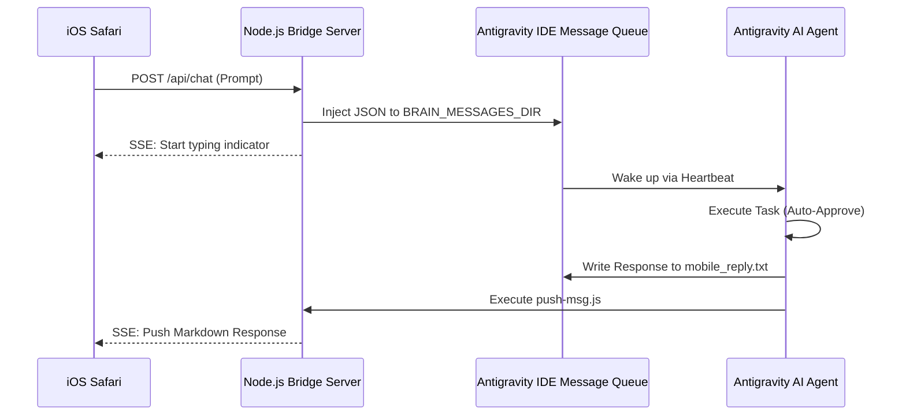

# 📱 Antigravity IDE iOS Apple Remote Control

🌐 **[中文文档 (Chinese README)](./README_CN.md)**


**Zero-latency iOS Mobile Bridge for Antigravity IDE**

Antigravity IDE iOS Apple Remote Control is a lightweight, zero-latency bridge that allows you to control your local Antigravity IDE and AI agents directly from your iPhone or iPad browser (Safari).

## ✨ Key Features

- **📱 True Mobile Freedom**: Code from anywhere. Control your AI agent from your bed, the couch, or on the commute.
- **⚡ Zero-Latency Streaming**: Uses Server-Sent Events (SSE) to achieve real-time typewriter effects and instant Markdown rendering.
- **🎙️ Siri Voice Integration**: Native support for the Web Speech API. Use Apple's dictation to control your IDE hands-free.
- **🔒 True Local Execution**: No cloud bots. Your phone securely talks to your actual local machine, running commands in your real workspace.
- **🎨 Native iOS Safari Feel**: UI is heavily optimized to prevent zooming, rubber-banding, and horizontal scrolling on mobile. 
- **🔄 Auto-Approval Bypass**: Agent automatically accepts and executes tasks when controlled via mobile, bypassing desktop UI clicks.

## 🏗️ Architecture



## 🚀 Quick Start

### 1. Requirements
- Node.js installed on your local machine.
- An iPhone or iPad connected to the same Wi-Fi network (or use Cloudflare Tunnel for remote access).

### 2. Start the Bridge Server
This tool uses pure vanilla Node.js to minimize friction. No `npm install` needed for the core server.
```bash
node server.js
```

### 3. Access from iPhone
Open Safari on your iPhone and navigate to your computer's local IP address on port 3888:
```text
http://<YOUR_LOCAL_IP>:3888
```

### 4. Remote Access (Optional)
If you want to code while away from your house, expose the server securely:
```bash
npm run tunnel
```
This starts a Cloudflare tunnel and gives you a secure public URL (e.g., `https://your-tunnel.trycloudflare.com`).

## ⚙️ IDE Configuration (AGENTS.md)

For the seamless auto-reply logic to work, your IDE needs to know how to respond to the mobile client. 
Copy the provided rules into your active workspace's `.agents/AGENTS.md` file. 

This rule forces the AI to:
1. Never ask for manual UI feedback.
2. Output its response to a scratchpad file.
3. Automatically execute `node scripts/push-msg.js` to send the response back to your iPhone.

## 🤝 Contributing
Contributions are welcome! Please feel free to submit a Pull Request.
