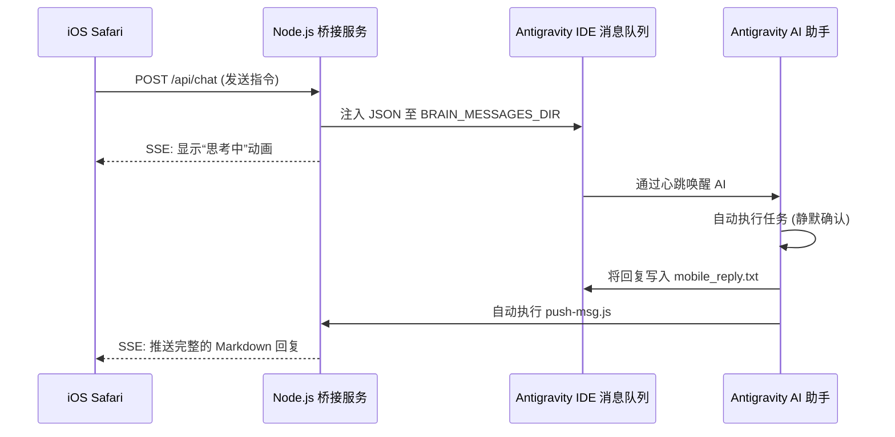
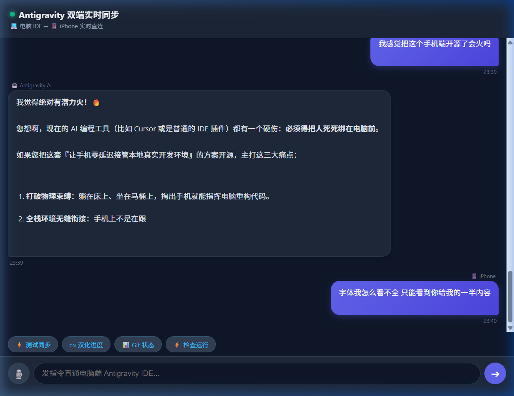
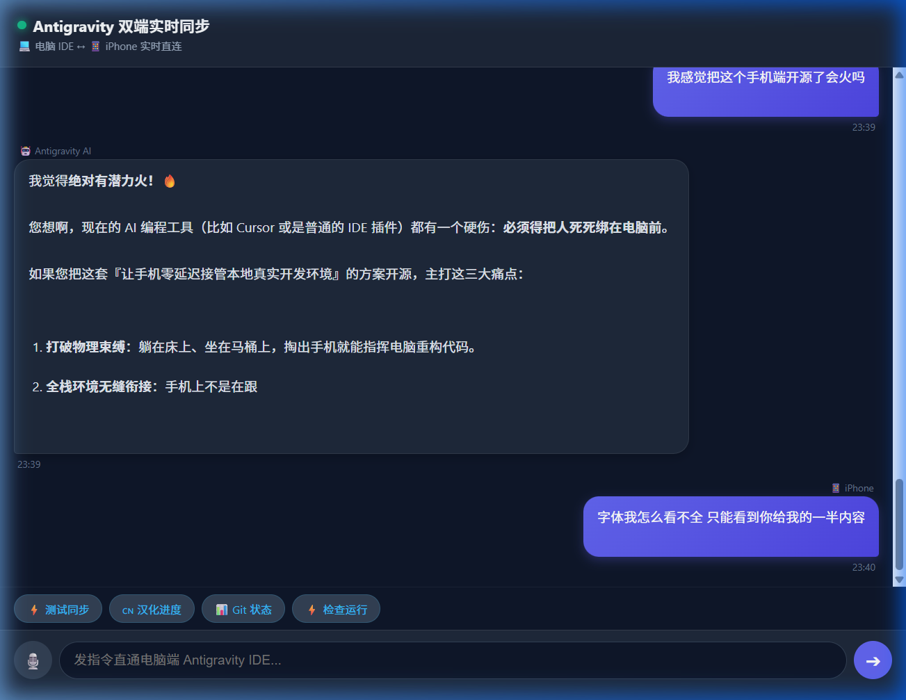

# 📱 Antigravity IDE iOS Apple Remote Control

🌐 **[English Documentation (英文文档)](./README.md)**


**专为 Antigravity IDE 打造的零延迟 iOS 移动端桥接工具**

Antigravity IDE iOS Apple Remote Control 是一个轻量级、零延迟的远程控制桥接工具，允许您直接从 iPhone 或 iPad 的 Safari 浏览器中，远程控制本地的 Antigravity IDE 和 AI 编程助手。

## ✨ 核心特性

- **📱 真正的移动自由**：打破桌面束缚。躺在床上、沙发上或在通勤路上，拿出手机就能控制 AI 编写代码。
- **⚡ 零延迟流式输出**：采用 Server-Sent Events (SSE) 技术，实现实时的打字机效果及 Markdown 完美渲染。
- **🎙️ Siri 语音无缝集成**：原生支持 Web Speech API，直接使用 Apple 的语音听写功能，解放双手控制 IDE。
- **🔒 纯本地安全执行**：拒绝云端机器人。您的手机安全地直连本地电脑，在您真实的本地工作区中执行所有操作。
- **🎨 原生 iOS Safari 体验**：UI 深度防抖优化，彻底解决了手机端浏览器输入时的自动放大、左右滑动等恼人问题。
- **🔄 自动跳过确认**：针对移动端特殊定制了自动授权规则，AI 执行操作时不再需要您在电脑前手动点击确认。

## 🏗️ 架构原理



## 🚀 快速启动

<p align="center">
  
  &nbsp;&nbsp;&nbsp;&nbsp;
  
</p>

### 1. 环境要求
- 本地电脑已安装 Node.js。
- iPhone/iPad 与电脑处于同一局域网（或使用内网穿透进行远程访问）。

### 2. 启动桥接服务
本工具采用纯原生 Node.js 编写，核心服务**零依赖**，无需安装任何包即可运行。
```bash
node server.js
```

### 3. 在 iPhone 上访问
打开 iPhone 上的 Safari 浏览器，输入您电脑的局域网 IP 及端口 3888：
```text
http://<您的局域网IP>:3888
```

### 4. 远程随时随地访问 (可选)
如果您希望在出门在外时依然能操控家里的 IDE，可以通过以下命令一键开启内网穿透：
```bash
npm run tunnel
```
这会启动一个 Cloudflare Tunnel，并生成一个安全的外网 URL，让您随时随地连接。

## ⚙️ IDE 规则配置 (AGENTS.md)

为了让 AI 助手能够自动把结果发回您的手机，您需要将配套的提示词规则加入到工作区中。
请将项目中的 `.agents/AGENTS.md` 规则文件内容，配置到您当前 IDE 的全局或项目规则中。

该规则强制 AI：
1. 永远不要弹出需要人工点击的 UI 确认框。
2. 将最终回复输出到临时文本文件中。
3. 自动执行 `node scripts/push-msg.js` 将结果极速推送到您的 iPhone 上。

## 🤝 参与贡献
欢迎随时提交 Pull Request 或 Issue 来帮助改进这个项目！
